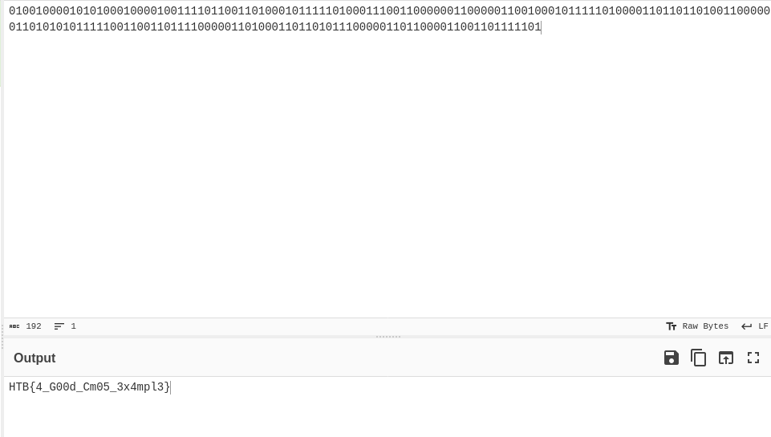

# Hack The Box Challenges - Low Logic :

## Introduction 
I have this simple chip, I want you to understand how it's works and then give me the output.

## Write-up :

As described on the image : 


We can see several logical gates : two And and one OR logical gates ([logic gates using transistor](https://www.google.com/search?client=ubuntu-sn&channel=fs&q=logic+gate+transistor))

The shematics can be represented like that : 


Now, we can create a python script wich do these operations thanks to input csv file to get the flag.

Then, after executing the [python file](resolve.py), we get the output of our electronic circuit.

```bash 
$ python resolve.py
010010000101010001000010011110110011010001011111010001110011000000110000011001000101111101000011011011010011000000110101010111110011001101111000001101000110110101110000011011000011001101111101
```

After decoding the output with cyberchef, we can submit the flag :



> Flag: HTB{4_G00d_Cm05_3x4mpl3}