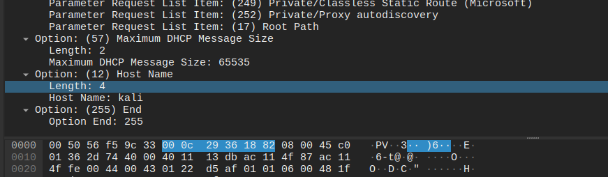
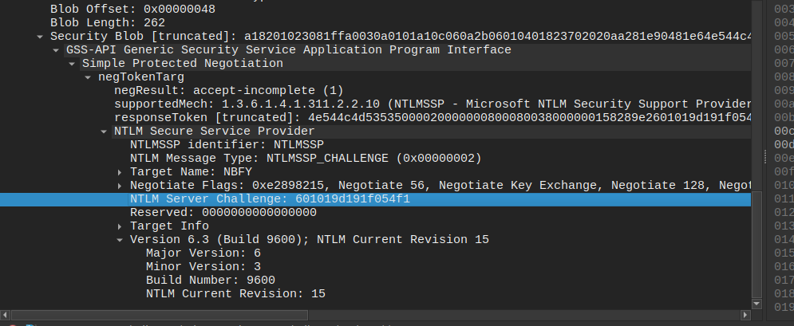
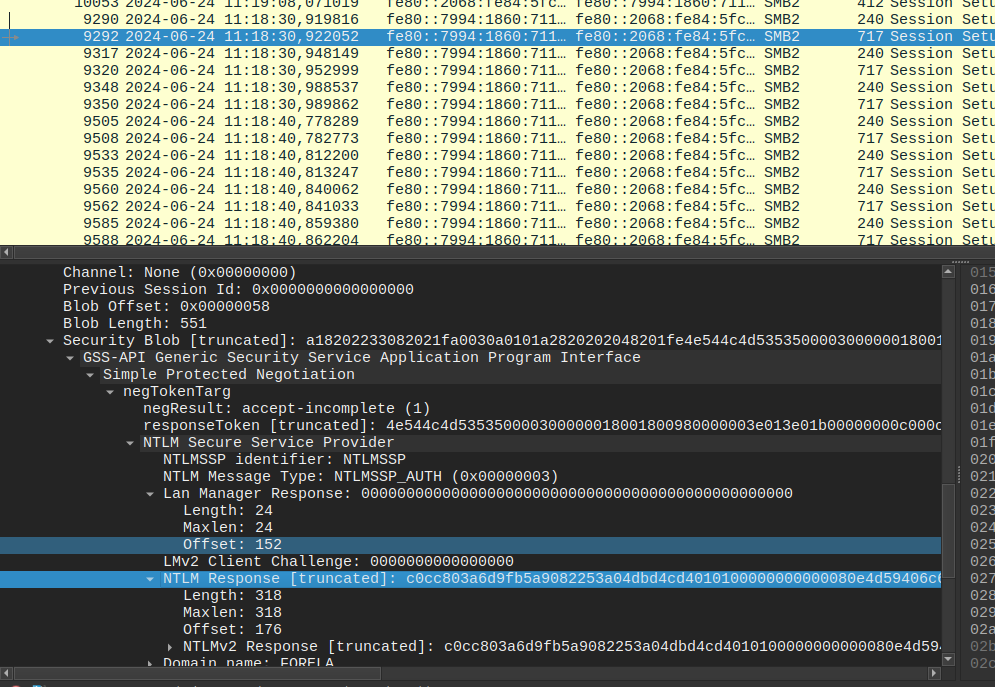

# Hack The Box - Sherlocks : Noxious

## Scenario 

The IDS device alerted us to a possible rogue device in the internal Active Directory network. The Intrusion Detection System also indicated signs of LLMNR traffic, which is unusual. It is suspected that an LLMNR poisoning attack occurred. The LLMNR traffic was directed towards Forela-WKstn002, which has the IP address 172.17.79.136. A limited packet capture from the surrounding time is provided to you, our Network Forensics expert. Since this occurred in the Active Directory VLAN, it is suggested that we perform network threat hunting with the Active Directory attack vector in mind, specifically focusing on LLMNR poisoning.

## Write-up :
- Suspected Attack: LLMNR poisoning attack
- Traffic directed to Forela-WKstn002 (ip: 172.17.79.136)

Informations about LLMNR poisoning attack [here](https://www.hackthebox.com/blog/llmnr-poisoning-attack-detection)

**Task 1: Its suspected by the security team that there was a rogue device in Forela's internal network running responder tool to perform an LLMNR Poisoning attack. Please find the malicious IP Address of the machine.**

We want to see the LLMNR traffic only by using this filter : udp.port == 5355

As we can see in the wireshark table :
```text
9265	68.433932	172.17.79.136	224.0.0.252	LLMNR	65	Standard query 0x2c01 AAAA DCC01
9269	68.440010	172.17.79.135	172.17.79.136	LLMNR	86	Standard query response 0xe708 A DCC01 A 172.17.79.135
```
The ip wich make LLMNR Query request is the ip 172.17.79.136 due to a DNS Error

and the ip 172.17.79.135 reply to that query.

We can suspect this ip to performing a LLMNR traffic poisonning.

> Answer: 172.17.79.135

**Task2: What is the hostname of the rogue machine?**

We use a new filter : ip.addr == 172.17.79.135 && dhcp
With this filter we see only dhcp request from the attaquer ip. 
DHCP requests help retrieve the hostname by obtaining Option 12 (Host Name) 



> Answer: kali

**Task3 : Now we need to confirm whether the attacker captured the user's hash and it is crackable!! What is the username whose hash was captured?**

To find credentials captured we put a filter on smb requests.
After applying the `smb2` filter :
we uderline that : 
```test
9641	78.459220	fe80::7994:1860:711:c243	fe80::2068:fe84:5fc8:efb7	SMB2	717	Session Setup Request, NTLMSSP_AUTH, User: FORELA\john.deacon
```

> Answer: john.deacon

**Task4:  In NTLM traffic we can see that the victim credentials were relayed multiple times to the attacker's machine. When were the hashes captured the First time?**

With the ntlmssp filter we find at the first occurence of Session setup  :
```text
9292	2024-06-24 11:18:30,922052	fe80::7994:1860:711:c243	fe80::2068:fe84:5fc8:efb7	SMB2	717	Session Setup Request, NTLMSSP_AUTH, User: FORELA\john.deacon
```

> Answer: 2024-06-24 11:18:30

**Task5: What was the typo made by the victim when navigating to the file share that caused his credentials to be leaked?**

It's the `DCCO1` typo wich cause the DNS error and allow the attaquer to reply to the LLMNR query request and leak credentials.

> Answer: DCC01

**Task6: To get the actual credentials of the victim user we need to stitch together multiple values from the ntlm negotiation packets. What is the NTLM server challenge value?**

In the first NTLMSSP_CHALLENGE packet:



> Answer: 601019d191f054f1

**Task7: Now doing something similar find the NTProofStr value.**

The NYProofStr is in the Response request.
Into the #9292 request :



> Answer: c0cc803a6d9fb5a9082253a04dbd4cd4

**Task8: To test the password complexity, try recovering the password from the information found from packet capture. This is a crucial step as this way we can find whether the attacker was able to crack this and how quickly.**

Let's crack the hash. 
Create a new file with this content :

john.deacon::FORELA:601019d191f054f1:c0cc803a6d9fb5a9082253a04dbd4cd4:010100000000000080e4d59406c6da01cc3dcfc0de9b5f2600000000020008004e0042004600590001001e00570049004e002d00360036004100530035004c003100470052005700540004003400570049004e002d00360036004100530035004c00310047005200570054002e004e004200460059002e004c004f00430041004c00030014004e004200460059002e004c004f00430041004c00050014004e004200460059002e004c004f00430041004c000700080080e4d59406c6da0106000400020000000800300030000000000000000000000000200000eb2ecbc5200a40b89ad5831abf821f4f20a2c7f352283a35600377e1f294f1c90a001000000000000000000000000000000000000900140063006900660073002f00440043004300300031000000000000000000

Let's crack this hash with hashcat : 
```bash
$ Hashcat -a0 -m5600 hashfile.txt rockyouwordlist.txt

Session..........: hashcat
Status...........: Exhausted
Hash.Mode........: 5600 (NetNTLMv2)
Hash.Target......: JOHN.DEACON::FORELA:601019d191f054f1:c0cc803a6d9fb5...000000
Time.Started.....: Tue Feb 11 18:24:26 2025 (1 sec)
Time.Estimated...: Tue Feb 11 18:24:27 2025 (0 secs)
Kernel.Feature...: Pure Kernel
Guess.Base.......: File (../SecLists/Passwords/rockyou.txt)
Guess.Queue......: 1/1 (100.00%)
Speed.#1.........: 11497.9 kH/s (1.66ms) @ Accel:512 Loops:1 Thr:64 Vec:1
Recovered........: 1/1 (100.00%) Digests (total), 1/1 (100.00%) Digests (new)
Progress.........: 11010048/14344384 (76.76%)
Rejected.........: 0/11010048 (0.00%)
Restore.Point....: 10485760/14344384 (73.10%)
Restore.Sub.#1...: Salt:0 Amplifier:0-1 Iteration:0-1
Candidate.Engine.: Device Generator
Candidates.#1....: NotMyPassword0K?-> NotMyPassword0K?
Hardware.Mon.#1..: Temp: 58c Util: 26% Core:1740MHz Mem:6000MHz Bus:8

Started: Tue Feb 11 18:24:17 2025
Stopped: Tue Feb 11 18:24:29 2025
```

> Answer: NotMyPassword0K?

**Task9: Just to get more context surrounding the incident, what is the actual file share that the victim was trying to navigate to?**

`10214	2024-06-24 11:19:18,419272	172.17.79.136	172.17.79.4	SMB2	174	Tree Connect Request Tree: \\DC01\DC-Confidential`

>Answer: \\DC01\DC-Confidential
