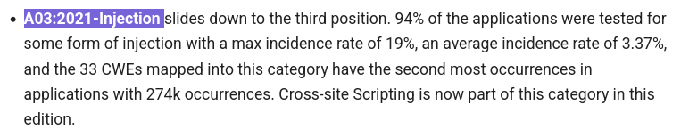
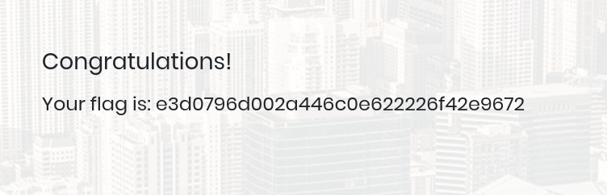

# HackTheBox - Starting Point: Appointment Write-up

## Introduction

In this write-up, we will walk through the steps to solve the "Appointment" machine from the HackTheBox Starting Point series. This machine is designed for beginners and provides a great opportunity to practice basic enumeration and exploitation techniques. We will cover the entire process from initial enumeration to gaining root access, highlighting key commands and methodologies used along the way.

## Walkthrough:

- **Task 1:**  What does the acronym SQL stand for? 
    > Answer: Structured query language

- **Task 2:**  What is one of the most common type of SQL vulnerabilities? 
    > Answer: SQL Injection

- **Task 3:**   What is the 2021 OWASP Top 10 classification for this vulnerability? 
  
    Let's look at [OWASP](https://owasp.org/Top10/) site in their top 10 section
    
    > Answer: A03:2021 – Injection

- **Task 4:**   What does Nmap report as the service and version that are running on port 80 of the target? 
    To see wich service running on our target machine we can run a nmap scan with the -A argument to perform a advanced scan.
    ```bash
        nmap -p 80 -A 10.129.46.17 
        Starting Nmap 7.94SVN ( https://nmap.org ) at 2025-01-29 11:34 CET
        Nmap scan report for 10.129.46.17
        Host is up (0.034s latency).

        PORT   STATE SERVICE VERSION
        80/tcp open  http    Apache httpd 2.4.38 ((Debian))
        |_http-server-header: Apache/2.4.38 (Debian)
        |_http-title: Login
    ```
    > Answer: Apache httpd 2.4.38 ((Debian)) 

- **Task 5:** What is the standard port used for the HTTPS protocol? 
    > Answer: 443

- **Task 6:**  What is a folder called in web-application terminology? 
    > Answer : directory

- **Task 7:**   What is the HTTP response code is given for 'Not Found' errors? 
    > Answer : 404

- **Task 8:**  Gobuster is one tool used to brute force directories on a webserver. What switch do we use with Gobuster to specify we're looking to discover directories, and not subdomains? 

    To know more about gobuster use, we can run the man command.
    ```bash 
    man gobuster 
        [...]
    Modes: dir - the classic directory brute-forcing mode
    ```
    > Answer : dir

- **Task 9:**  What single character can be used to comment out the rest of a line in MySQL?  
  > '#'

- **Task 10:** If user input is not handled carefully, it could be interpreted as a comment. Use a comment to login as admin without knowing the password. What is the first word on the webpage returned? 
  
    To bypass the password verification when user input is not handled carefully, you can use a SQL injection payload. For example:
    ```sql
    admin' OR 1=1;#
    ```
    This payload will comment out the rest of the SQL query, allowing you to bypass the password check and log in as the admin user.

    > Answer: admin' OR 1=1;#

- **Submit root flag** :
  After put this text as a username into the login input. We have access to the root flag.

    